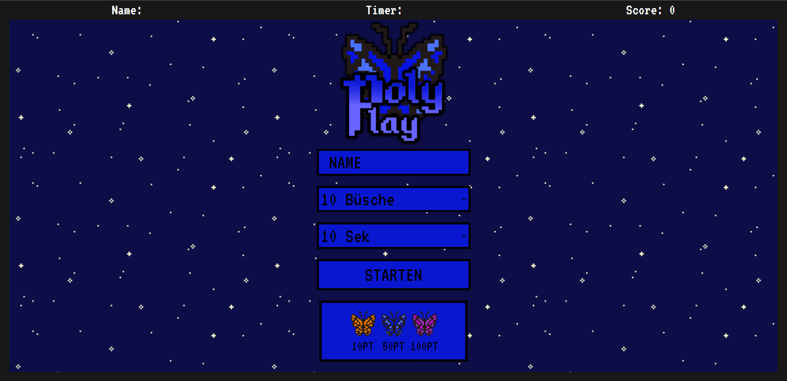
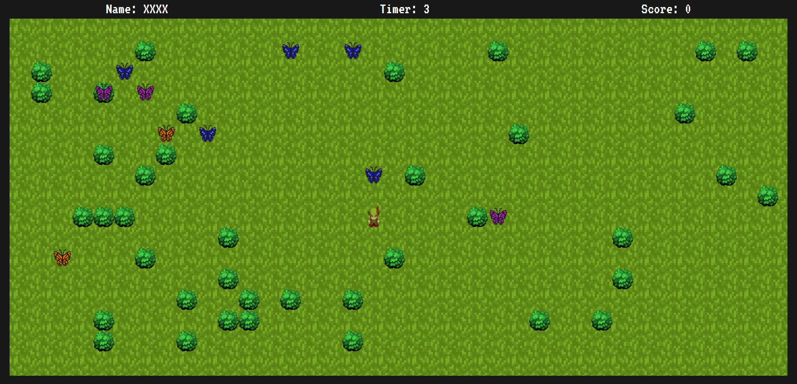

# PolyPlay: Schmetterlinge

[I.Startbildschirm](#i-startbildschirm)

[--I.I Selektoren](#ii-selektoren)

[--I.II Name-Input](#iii-nameinput)

[--I.III Spiel starten](#iiii-spiel-starten)

[--I.IV Legende](#iiv-legende)

[II. Der Spielflow](#ii-der-spielflow)

[--II.I Gameboard leeren und Hintergrund ändern](#iii-gameboard-leeren-und-hintergrund-ändern)

[--II.II Elemente generieren](#iiii-elemente-generieren)

[--II.III playerMovement() und Kollisionen](#iiiii-playermovement-und-kollisionen)

[--II.IV ButterflyMovement()](#iiiv-butterflymovement)

[--II.V setInterval()](#iiv-setinterval)

[III. Das Spielende](#iii-das-ende-des-spiels)

[III.I Das Scoreboard](#iiii-scoreboard)


## I. Startbildschirm


### I.I Selektoren

Da der Spieler möglichst frei darin sein soll, wie er spielen möchte, ist es nach aktuellem Stand möglich zu entscheiden, wie viele Büsche er platzieren und wie lange er spielen möchte.

Demonstrieren wir einen Selektor am Beispiel "Büsche":

**HTML:**

```HTML
<select name="Bushes" id="bushselector">
    <option value="10">10 Büsche</option>
    <option value="20">20 Büsche</option>
    <option value="30">30 Büsche</option>
    <option value="40">40 Büsche</option>
    <option value="50">50 Büsche</option>
    <option value="60">60 Büsche</option>
</select>
```

Der Selektor bekommt ein entsprechendes value, welches als String übergeben wird.

**JavaScript:**

```JavaScript
let selecinput = document.getElementById('bushselector');
let bnr = parseInt(selecinput.options[selecinput.selectedIndex].value);
```

Hier wird das jeweilige value ausgelesen (selecinput) und danach in einer kürzeren Variable in ein Integer geparst (bnr), damit man mit diesem Wert auch for-Schleifen erstellen kann.

Weiteres zu diesen Werten in der Sektion [ playerMovement() und Kollisionen](#iiiii-playermovement-und-kollisionen).

### I.II Name-Input

Wenn man an klassische Arcade Systeme und alte Filme denkt, wo Leute Spielautomaten bedienen, wird immer der Score am Ende, sowie der eingegebene Name des Spielers in einem [Scoreboard](#iiii-scoreboard) angezeigt. Hier kommt das Name-Input ins Spiel. Der Spieler gibt seinen Namen an und dieser wird beim starten des Spiels oben links angezeigt.

**HTML:**

Das Name-Input:

```HTML
<input id="nameinput" type="text" placeholder="NAME">
```

Die Anzeige des Namens oben links:

```HTML
<p>Name: <span id="name"></span></p>
```

**JavaScript:**

Initialisieren des eingebenen values:

```JavaScript
let nameinput = document.getElementById('nameinput');
```

Verarbeiten des Wertes:

```JavaScript
//Eingegebener Name oben links anzeigen
name.innerHTML = nameinput.value;
//Wenn nichts eingegeben, dann Platzhalter XXXX, damit das Feld nicht einfach leer bleibt
if(nameinput.value == ""){
name.innerHTML = "XXXX";
}
```

Sollte der Spieler keinen Namen eingeben wollen, ist das kein Problem, dann werden Platzhalterdaten verwendet (XXXX).

### I.III Spiel starten

```HTML
<button onclick="startGame()" id="startbtn" class="startbtn">STARTEN</button>
```

Ist der User mit seinen Eingaben zufrieden, kann er das Spiel starten, indem er auf den Button "STARTEN" klickt. daraufhin wird die startGame() Funktion ausgeführt und die eingebenen Daten werden, wie bereits beschrieben an die Anzeige oben übermittelt und das Spiel beginnt.

### I.IV Legende
Als kurze Erklärung wird unter dem Startbutton erläutert welche Schmetterlinge mit welchem Punktewert versehen sind.


```HTML
<div class="legende">
    <div class="schmetterlingcard">
      <div class="displayschmetterling"></div>
        <p>10PT</p>
        </div>
    <div class="schmetterlingcard">
    <div class="displayschmetterlingblau"><div>
        <p>50PT</p>
        </div>
     <div class="schmetterlingcard">
        <div class="displayschmetterlingli a"></div>
      <p>100PT</p>
     </div>
</div>
```
## II. Der Spielflow

### II.I Gameboard leeren und Hintergrund ändern
Damit das Spiel beginnen kann, müssen die Auswahlelemente verschwinden. Also wird das gesamte innere HTML des Gameboards in Einem geleert:
```JavaScript
//gameboard leeren, damit die Auswahlelemente verschwinden
gameboard.innerHTML = "";
```

Des Weiteren wird aus Design-Gründen der Hintergrund auf eine Wiese geändert. Dies geschieht mittels einer Funktion, die das background-image des Gameboards ändern soll. Die Funktion wird direkt nach dem erstellen ausgeführt:

```JavaScript
function changeBg(){
    gameboard.style.backgroundImage = "url(img/grass2.png)";
}
changeBg();
```
### II.II Elemente generieren
Ohne einen Spieler, Büsche oder Schmetterlinge könnte man nicht spielen.
Also beginnt das Programm damit jene zu erstellen.

**Beginnend mit dem Player:**
```JavaScript
let player = document.createElement("div");

function createPlayer(){
 player.classList.add("player");
    gameboard.appendChild(player);
 }
```
Hier wird noch kein mögliches Movement initialisiert. Dies kommt in der Sektion [playerMovement() und Kollisionen](#iiiii-playermovement-und-kollisionen).

Als nächstes werden die **Büsche** initialisiert und ins DOM eingehangen.

Als Vorbereitung wird ein Array mit dem Namen "blumenliste" initialisert:
```JavaScript
let blumenliste = [];
```
Um die Büsche innerhalb der Funktion generateBushes() zu erstellen, wird eine for-Schleife bnr-mal itteriert. Also ist die Wiederholungsrate der for-Schleife davon abhängig, welches value der Spieler im Startbildschirm gewählt hat.

In der for-Schleife wird erst das Element Busch erstellt, dann mit einer Style Klasse versehen.

Da der Busch zufällig auf dem Gameboard platziert werden muss, muss von der Math lib Gebrauch gemacht werden.

Dieses Projekt zielt darauf, dass sämtliche Werte von Player-Größe, bis Busch-Größe und eben auch die Positionen immer durch 40 teilbar sind. Dies hat diverse Vorteile in Themen wie Kollisionskontrolle, Positionierung oder Einsammeln der Schmetterlinge.

Zurück zur Platzierung. Was also nötig ist, sind 2 Werte, die innerhalb des Gameboards liegen und durch 40 teilbar sind.

2 Werte, weil jeweils die x und die y Achse bedacht werden müssen.

Die folgende Lösung ist hardcoded, dass bedeutet, dass Sie auf meine Bildschirmsettings abgestimmt sind.

In meinem ViewPort auf der X-Achse liegt das Gameboard im Intervall[20,1505].


Auf der Y-Achse im Intervall[40,708].

Mit diesem Wissen lässt sich eine Math Funktion schreiben.

Math.floor bildet eine ganze Zahl, keine Kommazahl.

Math.random erschafft eine zufällig generierte Zahl nach folgendem Prinzip:

```JavaScript
busch.style.left = Math.floor(Math.random() * 36 + 1) * 40 + 20 + "px";
```
Intervall[20,1445], weil der Schmetterling 40 Pixel breit ist und die Platzierung vom Objekt-Pixelbereich oben links ausgeht.

36+1 erstellt eine zufällige Zahl zwischen 1 und 36, multipliziert diese mit 40 und legt 20 Pixel obendrauf, damit der Wertebereich getroffen wird und auf jeden Fall durch 40 teilbar ist.

Danach werden ganau diese X und Y Werte im zuvor erwähnten Array blumenliste gespeichert, um später die Kollisionen errechnen zu können.

**Ganze Funktion:**
```JavaScript
function generateBushes(){
for(let i = 0; i<bnr+1;i++){
let busch = document.createElement("div");
busch.classList.add("blume");
 
 busch.style.top = Math.floor(Math.random() * 16 + 1) * 40 + 0 + "px";

                 
busch.style.left = Math.floor(Math.random() * 36 + 1) * 40 + 20 + "px";

blumenliste[i] = {
     x: busch.style.left,
     y: busch.style.top
 }
 gameboard.appendChild(busch);
    }
 }
```

Nach dem selben Prinzip werden nun auch die Schmetterlinge erstellt und ins DOM eingehangen. Da es aber 3 verschiedene Sorten Schmetterlinge gibt, muss zuvor eine weitere Zufallszahl im Intervall[1,3] erstellt werden, die darüber entscheidet, welche Art Schmetterling ins DOM eingehängt wird. Diese Zahl entscheidet über die Klasse, damit visuell gekennzeichnet wird, um welchem Schmetterling es sich handelt. Über die Punktegewichtung wird in einer anderen Funktion entschieden.

Im Array für die Schmetterlinge wird ebenfalls die Klasse des Schmetterlings übergeben, damit diese für die Punktevergabe ausgelesen werden kann.

**Ganze Funktion:**

```JavaScript
function generateButterflies(){
for(let i = 0; i < 10; i++){
 let zufallszahlschmetterling = Math.floor(Math.random() * 3 + 1);
 let schmetterling = document.createElement("div");
    if(zufallszahlschmetterling == 1){
        schmetterling.classList.add("schmetterling");
         }
     if(zufallszahlschmetterling == 2){
         schmetterling.classList.add("schmetterlingblau");
         }
    if(zufallszahlschmetterling == 3){
         schmetterling.classList.add("schmetterlinglila");
         }
          schmetterling.setAttribute("id","schmetterling"+i);


schmetterling.style.top = Math.floor(Math.random() * 16 + 1) * 40 + 0 + "px";
schmetterling.style.left = Math.floor(Math.random() * 36 + 1) * 40 + 20 + "px";

    schmetterlingliste[i] = {
     x: schmetterling.style.left,
     y: schmetterling.style.top,
     class: schmetterling.classList,
    };  
    gameboard.appendChild(schmetterling);
     }
 }
```
Letzten Endes müssen diese 3 thematisierten Funktionen ausgeführt werden:
```JavaScript
 createPlayer();
 generateBushes();
 generateButterflies();
```
## II.III PlayerMovement und Kollisionen
Damit der Player mit Knopfdrücken auf W,A,S,D (oder wahlweise mit den Pfeiltasten) bewegt werden kann, muss das Dokument mit einem **EventListener** versehen werden:
```JavaScript
document.addEventListener("keydown",playerMovement);
```
Bevor die Funktion playerMovement() initialisiert wird, werden **4 Booleans** erstellt, die hilfreich bei der **Kollision mit Büschen** werden:
```JavaScript
let kollisionunten = false;
let kollisionoben = false;
let kollisionrechts = false;
let kollisionlinks = false;
```
Die Funktion playerMovement() beschäftigt sich zunächst damit den eingebenen Key und die aktuelle Player Position auszulesen:
```JavaScript
let key = event.key;
let x = player.offsetLeft;
let y = player.offsetTop;
```
Danach wird genauer überprüft, ob die oben genannten Tasten zur Bewegung gedrückt wurden. Falls nicht passiert einfach nichts.

Im folgenden erkläre ich die **Bewegung am Beispiel W**, das System ist bei jeder Richtung grundsätzlich gleich:

 Bevor der Player bewegt wird, wird in einer bnr-langen for-Schleife überprüft, ob der player **von unten** an einen Busch stößt. Genauer gesagt:
 Ist die **X Koordinate** am Busch aus der Liste "blumenliste" die gleiche **UND** ist der **Y Wert des aktuell geprüften Busches + 40** derselbe, wie der **Y Wert des Spielers**, liegt eine **Kollision von unten vor** und das Boolean Kollisionunten wird auf **true** gesetzt, was dazu führt, dass die Bewegung nicht ausgeführt werden kann. Hier äußert sich der Vorteil, dass jeder Wert in diesem Projekt durch **40 teilbar** ist.

 **Wenn blumenliste[i].x und blumenliste[i].y oben links am Busch beschreibt, dann ist blumenliste[i].x und (blumenliste[i].y + 40) links unten.**

Nach genau diesem System lässt sich eine Kollsion in jede Richtung überprüfen.

Zur Erklärung:

**blumenliste[i].x und blumenliste[i].y = oben links**

**blumenliste[i].x und (blumenliste[i].y + 40) = unten links**

**(blumenliste[i].x + 40) und blumenliste[i].y = rechts oben**

**(blumenliste[i].x + 40) und (blumenliste[i].y + 40) = rechts unten**

Liegt keine Kollision vor, bleibt das Boolean **false** und der untere Code wird ausgeführt.
Aus designtechnischen Gründen wird die Blickrichtung des Players geändert, indem der Hintergrund des DIV-Elements geändert wird.

Die Bewegung ist nichts anderes als **player.style.top = y - bewegungsweite + "px"**;

Man könnte also auch sagen, dass der **Spieler** in die entsprechende Richtung **gezogen, oder gedrückt wird**.

**Beispiel an W:**

```JavaScript
//Hoch w oder Pfeiltaste hoch
if (key == "w" || key=="ArrowUp") {
    kollisionunten = false;
for(let i = 0; i < bnr+1; i++){
 if(blumenliste[i].x == player.style.left && 40+parseInt(blumenliste[i].y)+"px" ==   player.style.top){
         kollisionunten = true;
        }
    }
    if (y > 40 && kollisionunten == false) {
         player.style.backgroundImage = "url(img/hero-idle-back.png)";
        player.style.top = y - bewegungsweite + "px";
          }
        }

//Bewegungsweite = 40
```
Innerhalb von playerMovement() wird ebenfalls überprüft, ob ein **Schmetterling gefangen** wurde oder nicht. Wenn ja, werden die Punkte oben erhöht.
Hier erschließt sich ein weiterer Vorteil daran, dass alle Werte in diesem Projekt durch 40 teilbar sind. **Da der Player und ein Schmetterling gleich groß sind, muss lediglich überprüft werden, ob die X und die Y Koordinate deckungsgleich sind.** Ist dies der Fall, soll der Schmetterling als **gesammelt** gelten.

Um nun zu erkennen, was für eine **Art Schmetterling** eingesammelt wurde, muss geschaut werden, welchen Wert **schmetterlingsliste[i].class** hat. Daran kann eindeutig gesehen werden, welcher Schmetterling eingesammelt wurde und dementsprechend können Punkte verteilt werden.

Nachdem ein Schmetterling gesammelt wurde, muss automatisch ein neuer generiert werden. Hier wird die selbe **Funktionalität von generateButterflies() angedeutet**, um einen neuen Schmetterling des selben Typs nachzusetzen.

**Ganze Funktion:**
```JavaScript
let pt = 0;
//Da sich alle Positionen durch 40 teilen lassen, lässt sich diese Funktion sehr simpel etablieren
 for(let i=0; i < 10; i++){
    if(schmetterlingliste[i].x == player.style.left && schmetterlingliste[i].y == player.style.top){

    //Punkte erhöhen
    if(schmetterlingliste[i].class == "schmetterling"){
     pt = parseInt(scoreticker.innerHTML) + 10;
     }
    if(schmetterlingliste[i].class == "schmetterlingblau"){
    pt = parseInt(scoreticker.innerHTML) + 50;
    }
     if(schmetterlingliste[i].class == "schmetterlinglila"){
      pt = parseInt(scoreticker.innerHTML) + 100;
    }
scoreticker.innerHTML = pt;   

 //Direkt einen neuen Schmetterling platzieren

let aktuellerschmetterling = document.getElementById("schmetterling"+i);

//Zufälliges Platzieren nach selbem Prinzip, wie sonst auch
aktuellerschmetterling.style.top = Math.floor(Math.random() * 16 + 1) * 40 + 0 + "px";
 aktuellerschmetterling.style.left = Math.floor(Math.random() * 36 + 1) * 40 + 20 + "px";
 schmetterlingliste[i].x = aktuellerschmetterling.style.left;
 schmetterlingliste[i].y = aktuellerschmetterling.style.top;
 schmetterlingliste[i].class = aktuellerschmetterling.classList;
 }
}
```
## II.IV ButterflyMovement()
Damit sich die Schmetterlinge bewegen können, muss eine weitere Funktion her.
Diese Funktion baut darauf, **wieder und wieder in einem Intervall aufgerufen zu werden** (dazu mehr in [setInterval()](#iiv-setinterval)). Daher brauchen wir eine Variable namens counter, die am Ende der Funktion erhöht wird und bei 10 wieder auf 0 gesetzt wird, um den **Wertebereich** einzuhalten.


In der Funktion wird zuerst ein **Schmetterling im DOM über seine ID angesprochen**. Danach wird eine **zufällige Nummer im Intervall[1,4]** generiert, die darüber **entscheiden wird in welche Richtung der Schmetterling bewegt wird**.

Das Prinzip, wie der Schmetterling bewegt wird, ist immer gleich. Erst wird die **ID** des jeweiligen Schmetterlings angesprochen und über die **Bewegungsweite** verändert, dann wird der jeweilige **Array Eintrag** entsprechend angepasst, damit die Funktion playerMovement() weiterhin mit diesen Werten rechnen kann.

```JavaScript
let counter = 0;
 function moveButterflies(){
//Schmetterling im DOM ansprechen
      let aktuellerschmetterling = document.getElementById('schmetterling'+counter);
//Zufallszahl generieren
      let randomnumber = Math.floor(Math.random() * 4 + 1);

//1 = Bewegung nach oben mit Check, ob der Schmetterling über den Rand gehen würde
      if(randomnumber == 1 && counter < 10){
        aktuellerschmetterling.style.top = parseInt(schmetterlingliste[counter].y) - bewegungsweite  +"px";
        schmetterlingliste[counter].y = aktuellerschmetterling.style.top
        if(parseInt(aktuellerschmetterling.style.top) <= 40){
          aktuellerschmetterling.style.top = 40 +"px"
          schmetterlingliste[counter].y = 40+"px";
        }
      }

//2 = Bewegung nach unten mit Check, ob der Schmetterling über den Rand gehen würde
        if(randomnumber == 2 && counter < 10){
        aktuellerschmetterling.style.top = parseInt(schmetterlingliste[counter].y) + bewegungsweite  +"px";
        schmetterlingliste[counter].y = aktuellerschmetterling.style.top
        if(parseInt(aktuellerschmetterling.style.top) >= 640){
          aktuellerschmetterling.style.top = 640 +"px"
          schmetterlingliste[counter].y = 640+"px";
        }
      }

//3 = Bewegung nach rechts mit Check, ob der Schmetterling über den Rand gehen würde
       if(randomnumber == 3 && counter < 10){
        aktuellerschmetterling.style.left = parseInt(schmetterlingliste[counter].x) + bewegungsweite  +"px";
        schmetterlingliste[counter].x = aktuellerschmetterling.style.left
        if(parseInt(aktuellerschmetterling.style.left)  >= 1420){
          aktuellerschmetterling.style.left = 1420 +"px"
          schmetterlingliste[counter].x = 1420+"px";
        }
      }

//4 = Bewegung nach links mit Check, ob der Schmetterling über den Rand gehen würde
        if(randomnumber == 4 && counter < 10){
        aktuellerschmetterling.style.left = parseInt(schmetterlingliste[counter].x) - bewegungsweite  +"px";
        schmetterlingliste[counter].x = aktuellerschmetterling.style.left
        if(parseInt(aktuellerschmetterling.style.left) <= 20){
          aktuellerschmetterling.style.left = 20 +"px"
          schmetterlingliste[counter].x = 20+"px";
        }
      }
      counter++
      if(counter == 10){
        counter = 0;
      }
     }
```
## II.V setInterval()
Wie bereits erwähnt sollen die Schmetterlinge in einem **bestimmten Interavall** bewegt werden. Im besten Falle alle **10 Schmetterlinge pro Sekunde**.
Dies lässt perfekt mit **setInterval()** einstellen:
```JavaScript
     setInterval(function(){
      moveButterflies();
     },100);
```
Zu Letzt soll während des Spiels ein Timer runterzählen: 
```JavaScript
    const intid = setInterval(function(){
      Timer();
      if(s == -1){
        clearInterval(intid);
        scoreboard();
      }
     },1000)
```
Läuft der Timer auf 0, wird die Funktion Scoreboard() aufgerufen, die am Ende des Spiels aufgerufen wird.

## III. Das Ende des Spiels

### III.I Scoreboard
Der letzte Schritt des Spiels ist das **Anzeigen eines Scoreboards**. Sprich der **finale Punktestand und der Name des Spielers**. Erst wird wieder das gesamte **Gameboard geleert**. Danach werden nacheinander eine schwarze Box, die Überschrift "Scoreboard" und ein Textabschnitt geladen, der sowohl den Namen, wie auch den Punktestand aus den Daten oben ausliest.

```JavaScript
function scoreboard(){
gameboard.innerHTML="";
 gameboard.style.backgroundImage = "url(img/StarSky.gif)";
 gameboard.classList.add("playgroundbeforestart");
let scoreboardrahmen = document.createElement("div")
 scoreboardrahmen.classList.add("scoreborder");
gameboard.appendChild(scoreboardrahmen);
let scoreboardheading = document.createElement("p");
scoreboardheading.classList.add("finalpunkte");
scoreboardheading.innerHTML = "~SCOREBOARD~";
let finalscore = document.createElement("p");
finalscore.classList.add("finalpunkte");
let punktestand = document.getElementById("scoreticker").innerHTML;
let playername = document.getElementById("name").innerHTML;
finalscore.innerHTML = playername + " ... "+ punktestand + " PUNKTE";
scoreboardrahmen.appendChild(scoreboardheading);
scoreboardrahmen.appendChild(finalscore);
 }
```